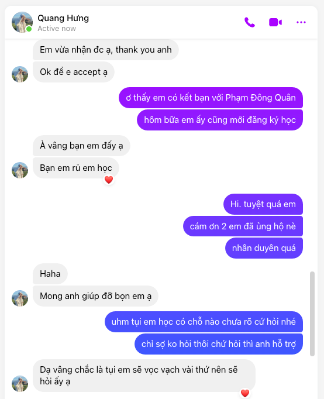
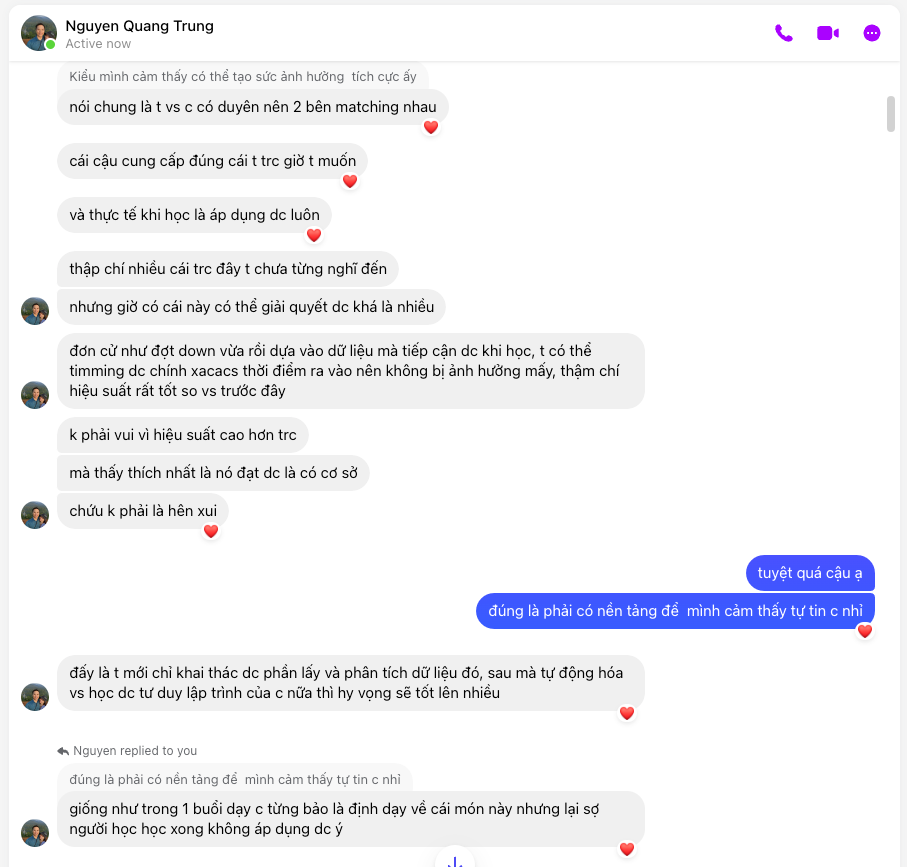
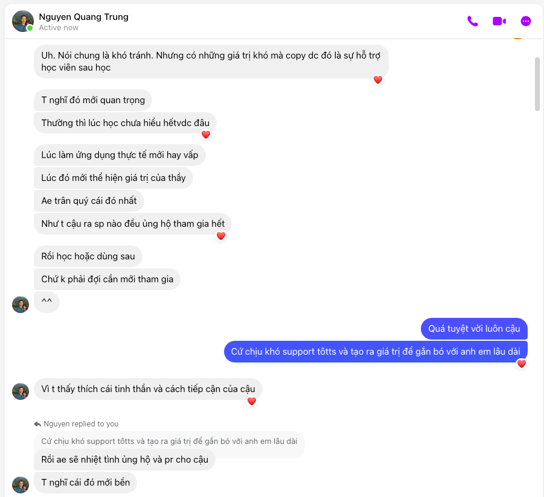
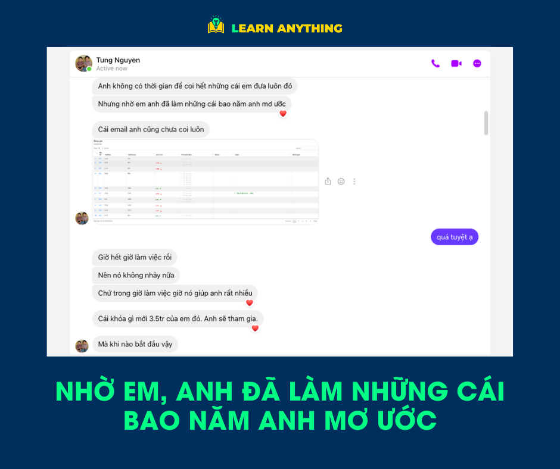
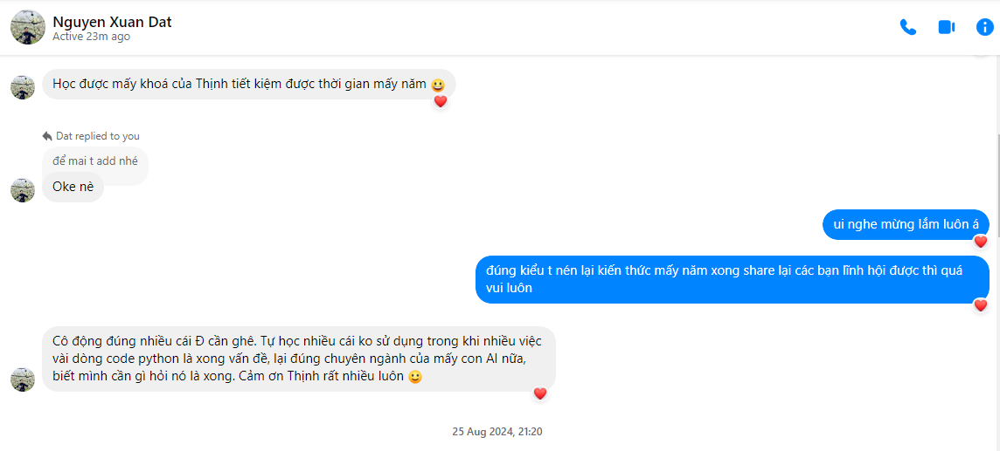
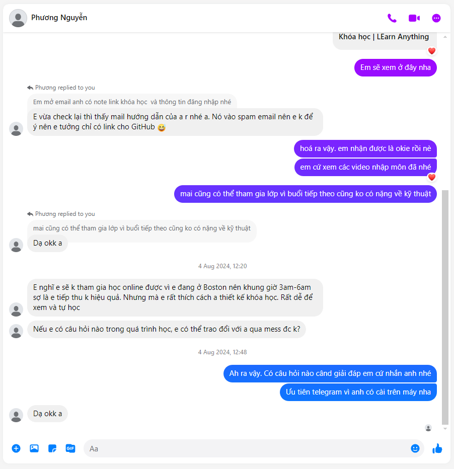
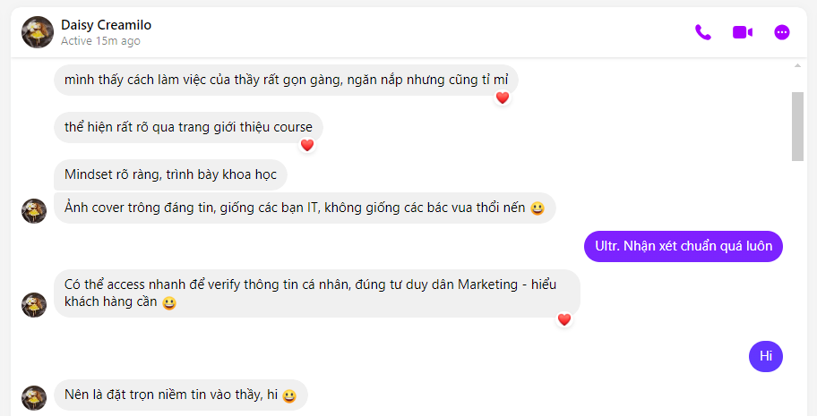
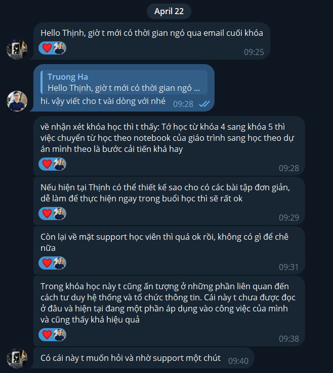

---
aliases:
  - Cảm nhận học viên về khóa học Python tại Vnstock x Learn Anything
created: 2024-09-22 21:06:00
progress: raw
blueprint:
  - "[[Obsidian PKM Mastery]]"
impact: 5
urgency: 
tags: 
category: 
---
# Testimonial Khoá học

> [!success]
> Tổng hợp các chia sẻ từ cộng đồng học viên Python tham gia khóa học được tổ chức bởi  Learn Anything x Vnstock

## Python chứng khoán
- Tin nhắn
	- Messenger
	- Telegram
- Nhóm Học viên
- Recommendation

## Python Web Scraping
- Tin nhắn
	- Messenger
	- Telegram
	- Nhóm Học viên
	- Recommendation

# Quotes

## Python K8

## Python K7
### Trung Nguyen

### Anh Tùng Nguyễn

> [!quote]
> Nhờ em mà anh đã làm được những cái bao năm anh mơ ước

### Nguyễn Xuân Đạt

> [!quote]
> Học được mấy khoá của Thịnh tiết kiệm được thời gian mấy năm !😃
> Cô đọng đúng nhiều cái Đạt cần ghê. Tự học nhiều cái ko sử dụng trong khi nhiều việc vài dòng code python là xong vấn đề, lại đúng chuyên ngành của mấy con AI nữa, biết mình cần gì hỏi nó là xong. Cảm ơn Thịnh rất nhiều luôn !🙂

### Phương Nguyễn

### Cường Đặng (Anh)

## Python K6

### Anh Thanh Lê, Hà Nội

> [!quote]
> "Để học với Thịnh Vũ thì mình cũng lướt internet nhiều rồi và mình cũng chọn cho mình một người thầy để theo học. Mình chọn Thịnh Vũ đồng thời mình chọn cho con gái đang theo học ngành phân tích dữ liệu cùng theo học. Mình thấy rằng nội dung các bài giảng của Thịnh Vũ rất là chi tiết và để làm được như vậy không hề đơn giản đâu, kể cả những người đang làm về công nghệ thông tin hiện tại."

*(\*) Anh Thanh từng là lập trình viên nhưng hiện tại đã chuyển qua làm về phát triển sản phẩm hơn 10 năm trở lại đây. Hiện tại anh Thanh và con gái 19 tuổi đã tham gia lớp K6 sau khi đăng ký từ K5. Nội dung trên đây được anh chia sẻ trong buổi khai giảng khóa học Python K6.*
### Anh Hùng Nguyễn (Joe)

> [!quote]
> Lớp học python ứng dụng cho thị trường chứng khoán Việt Nam của [Vũ Thịnh](https://www.facebook.com/mr.thinh.ueh?__cft__[0]=AZWKy7MFFxJlnA0ygJoovZ5nu5vEBc86KRBOVgjP9Gk_P5TW7R355f8a_Ra-EQjuc_TyIBzNuXWb2RYtbzGpnDkAfeSPlDZI0R1VneJ-kqbiHQ&__tn__=-]K-R) thật sự bài bản, có tính ứng dụng cao và không hề nhàm chán. Thời lượng khóa học chỉ có 10 buổi nhưng nhờ sự chi tiết và tận tâm của người dạy có thể giúp cho người chưa biết gì về code có thể có một khởi đầu đầy hào hứng để tìm hiểu về Python và tiếp tục tìm hiểu sâu hơn về sau này. Kho thư viện Vnstock thực sự hữu ích và tiết kiệm được nhiều công sức giúp cho người mới nhanh chóng tiếp cận được các nguồn dữ liệu khác nhau trên TTCK VN. [Chi tiết](https://www.facebook.com/hungboss1/posts/pfbid02cwNtDmbzJ1pLTp9gwM4KED1iYpAt6ELkfbF9bszgHFJGbRChiBKWNfePVj6D4MtJl)

### Chị Chu Hải Nguyên

> [!quote]
> Mình thấy cách làm việc của thầy rất gọn gàng, ngăn nắp nhưng cũng tỉ mỉ thể hiện rất rõ qua trang giới thiệu course. Mindset rõ ràng, trình bày khoa học. Ảnh cover trông đáng tin, giống các bạn IT, không giống các bác vua thổi nến !😃 Có thể access nhanh để verify thông tin cá nhân, đúng tư duy dân Marketing - hiểu khách hàng cần !😃 Nên là đặt trọn niềm tin vào thầy, hi !😃

## Python K5

### Trương Đắc Nguyên

### Anh Dũng Nguyễn

> [!quote]
> Học phí cao chút nhưng anh thấy em rất chuyên nghiệp, lượng kiến thức cung cấp nhiều. Cũng đáng giá.

### Anh Dony Tạ & Đinh Công Hợp

## Python K4

### Trường Hà - BIDV Hà Nội

> [!quote]
> Tớ học từ khóa 4 sang khóa 5 thì việc chuyển từ học theo notebook của giáo trình sang học theo dự án mình theo là bước cải tiến khá hay. 
> Về mặt support học viên thì quá ok rồi, không có gì để chê nữa
> Trong khóa học này t cũng ấn tượng ở những phần liên quan đến cách tư duy hệ thống và tổ chức thông tin.

