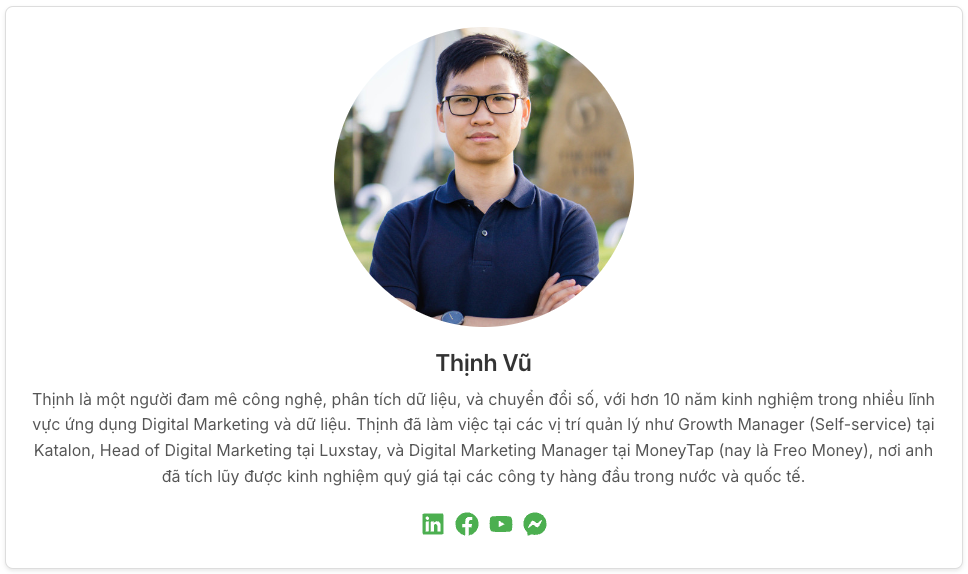

---
aliases:
  - Hellow World!
created: 2024-09-27 01:09:00
progress: raw
blueprint:
  - "[[Obsidian PKM Mastery]]"
impact: 
urgency: 
tags: 
category: 
---

## Giới thiệu

### Learn Anything

Chào các bạn! Mình là Thịnh. Mình bắt đầu khám phá Obsidian từ năm 2021 và từ đó đã trở thành một người đam mê và tìm hiểu chuyên sâu về ứng dụng công cụ này trong việc ghi chú và quản lý tri thức cá nhân. Mình rất vui khi có thể chia sẻ kinh nghiệm và kiến thức của mình với mọi người.

Bạn có thể tìm thấy những chia sẻ của mình về Obsidian trên Google, YouTube và qua các trang web mình phát triển như [thinhvu.com](https://thinhvu.com), [learn-anything.vn](https://learn-anything.vn) cùng kênh YouTube Learn Anything.

**Hiện tại, mình đang chuẩn bị ra mắt một khóa học toàn diện về Obsidian để giúp các bạn khai thác tối đa sức mạnh của công cụ này và đồng thời phát triển bền vững trên hành trình lan toả kiến thức. Trước tiên, bạn hãy bắt đầu trải nghiệm Vault mẫu Obsidian mà mình đã chuẩn bị cho các bạn làm quen trước khi đi xa hơn nhé!**

### Vnstock

Trong hành trình của mình, mình đã phát triển và ra mắt **thư viện Python [Vnstock](https://vnstocks.com/)**—một công cụ mạnh mẽ cung cấp dữ liệu chứng khoán Việt Nam. Thật vui khi Vnstock đã đạt hơn 1.000.000 lượt tải về và 35.000 lượt tải mỗi tháng trong năm 2026. Vnstock hiện là thư viện phổ biến nhất tại Việt Nam cho việc tải dữ liệu chứng khoán tự động bằng Python, và mình rất hạnh phúc khi nhận được sự ủng hộ từ cộng đồng đầu tư và các chuyên gia.

Không chỉ dừng lại ở việc phát triển công cụ, mình còn tổ chức 9 khóa đào tạo về [Vibe Coding và phân tích dữ liệu chứng khoán với Python](https://vnstocks.com/docs/khoa-hoc/khoa-hoc-python-vnstock-learn-anything). Mình đã có cơ hội đồng hành cùng cộng đồng 1000+ học viên tại nền tảng đào tạo [learn-anything.vn](http://course.learn-anything.vn/), giúp họ nắm vững Python, AI và áp dụng hiệu quả trong đầu tư, phát triển cá nhân. Xem thêm [4. Feedback khoá học](4.%20Feedback%20khoá%20học%20Python.md).

**Nếu bạn quan tâm đến các khóa học sắp tới hoặc cần hỗ trợ trong việc học Python, phân tích dữ liệu hay sử dụng Obsidian, đừng ngần ngại liên hệ với mình nhé!**

## Kết nối

- Kết nối với mình qua Facebook: [Thịnh Vũ](https://www.facebook.com/mr.thinh.ueh/)
- Đăng ký nhận bản tin trên Substack: [Learn Anything](https://learnanything.substack.com/)
- Theo dõi kênh YouTube: [Learn Anything](https://www.youtube.com/@learn_anything_az?sub_confirmation=1)
- Tham gia Fanpage: [Learn Anything](https://www.facebook.com/learn.anything.az)

**Hãy theo dõi và kết nối với mình để không bỏ lỡ những cập nhật và chia sẻ hữu ích!**

### Trang thông tin chính thức

- Website Learn Anything: [learn-anything.vn](http://learn-anything.vn/)
- Website Vnstock: [vnstocks.com](https://vnstocks.com/)