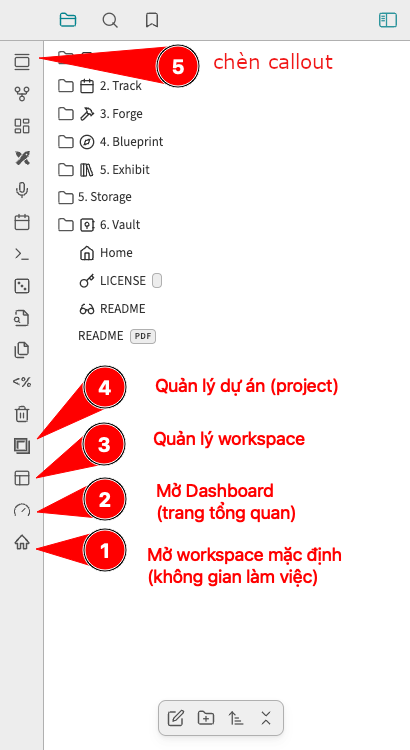

---
aliases:
  - 
created: 2024-09-29 17:11:00
progress: raw
blueprint:
  - 
impact: 
urgency: 
tags:
  - 
category:
  - 
---

> [!important]
> Hãy tự do ghi chú lại các ý tưởng bất chợt, không quá cố gắng hoàn hảo mà cho chúng có cơ hội được hoàn thiện trong suốt vòng đời của mình.

# Sử dụng phím tắt

Xem thêm: [Hệ thống phím tắt trong Obsidian FLOW](../5.%20Exhibit/FLOW%20&%20PKM/Hệ%20thống%20phím%20tắt%20trong%20Obsidian%20FLOW.md)

# Sử dụng giao diện đồ hoạ
- Thanh công cụ Ribbon

## Quản lý nhiệm vụ cần làm

> [!todo]
> Sử dụng chức năng tích hợp trong FLOW PKM plugin để quản lý nhiệm vụ cần làm
> Dùng phím tắt Cmd + Opt + T để kích hoạt giao diện quản lý nhiệm vụ trong FLOW Dashboard với đầy đủ tính năng hoặc quản lý đơn giản qua Sidebar. 
> Phím tắt nhập cài đặt nhanh cho nhiệm vụ bao gồm `@` cho thời gian cần thực hiện, `$` cho giờ cần thực hiện, `!` để cài đặt mức độ quan trọng của nhiệm vụ. 

Chức năng thêm và quản lý nhiệm vụ đơn giản qua Sidebar từ FLOW PKM plugin.

## Home

> Liên quan: [[Obsidian PKM Mastery]] | [[Obsidian PKM Mastery]]