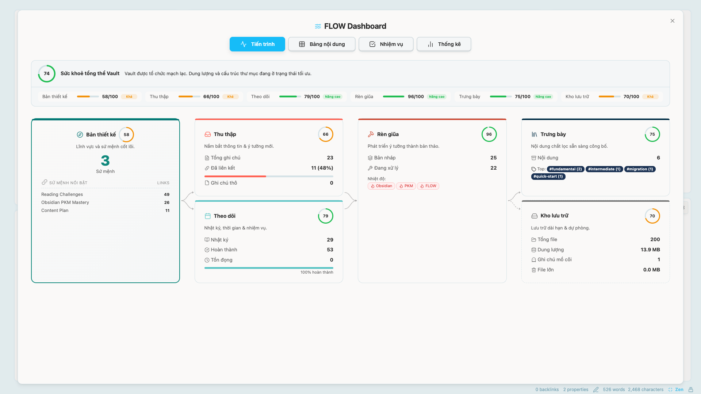
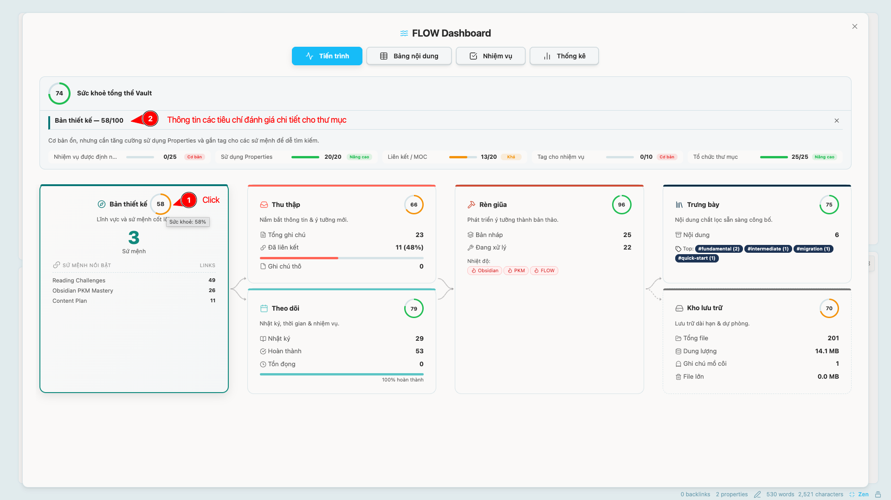

blueprint: "[[Obsidian PKM Mastery]]"
progress: done
impact: 5
tags:
  - type/guideline
  - topic/obsidian
  - topic/pkm
---

![[Navigation Bar]]

# 📊 Hướng dẫn sử dụng & Hiểu về FLOW Dashboard

FLOW Dashboard là trung tâm chỉ huy giúp bạn theo dõi "sức khỏe" và "dòng chảy" tri thức bên trong Vault của mình. Dashboard sử dụng một thuật toán chấm điểm tự động để đánh giá mức độ hiệu quả của bạn theo phương pháp FLOW.

## ❓ Vì sao điểm số ban đầu của bạn có thể thấp?

Khi bạn mới tải về hoặc clone vault mẫu này, bạn có thể sẽ thấy điểm số ở mức thấp (màu cam hoặc đỏ). Điều này là hoàn toàn bình thường! Thuật toán chấm điểm của FLOW ưu tiên **hoạt động thực tế và độ tươi mới** của tri thức. Dưới đây là lý do:

1. **Độ tươi mới của ghi chú - Thư mục Capture:**
   - *Cách tính:* Dựa trên thời gian tạo file.
   - *Vấn đề ban đầu:* Khi tải file từ Github hoặc copy từ nguồn khác, hệ điều hành có thể giữ nguyên thời gian tạo từ rất lâu trong quá khứ. Do đó, các ghi chú trong thư mục Capture sẽ bị tính là ghi chú thô tồn đọng quá lâu chưa được xử lý.
2. **Tỷ lệ hoạt động - Thư mục Forge:**
   - *Cách tính:* Dựa trên thời gian chỉnh sửa file gần nhất và số lượng dự án (thư mục con) đang kích hoạt.
   - *Vấn đề ban đầu:* Nếu bạn chưa bắt tay vào viết lách hay tổ chức thư mục con, các dự án sẽ bị đánh giá là "ngủ đông" khiến điểm số của Forge bị kéo xuống.
3. **Tính kỷ luật - Thư mục Track:**
   - *Cách tính:* Đếm số lượng Daily Notes bạn tạo ra, sự xuất hiện của các thẻ cảm xúc (`mood`, `feeling`), và tỷ lệ dọn dẹp các task tồn đọng.
   - *Vấn đề ban đầu:* Vault mới tải về thường chưa có lịch sử viết nhật ký đều đặn của riêng bạn.

## 💡 Làm thế nào để cải thiện điểm số?

Mục tiêu của FLOW Dashboard không phải là để chấm điểm cho vui, mà là "người huấn luyện viên" thúc đẩy bạn duy trì thói quen PKM tốt. Khi bạn bắt đầu sử dụng Vault vào thực tế, điểm số sẽ tự động tăng lên:

- Thường xuyên thu thập và xử lý các ghi chú thô trong `Capture`.
- Tạo các dự án/chủ đề nhỏ (subfolder) trong `Forge` và thường xuyên cập nhật nội dung.
- Dọn dẹp các ghi chú mồ côi không có liên kết và xóa bỏ các tệp đính kèm thừa trong `Vault`.
- Ghi chép nhật ký hàng ngày (Daily Note) trong `Track` và không để sót công việc (`- [ ]`).

> [!TIP] Xem chi tiết điểm số
> Bạn có thể **click trực tiếp vào từng vòng tròn điểm số** của các thư mục (`CAPTURE`, `FORGE`, `TRACK`, v.v.) trên giao diện Dashboard. Một bảng phân tích chi tiết sẽ hiện ra, chỉ rõ chính xác tiêu chí nào đang bị trừ điểm và bạn cần làm gì để khắc phục!

Hãy bắt đầu viết và để dòng chảy tri thức của bạn tự do vận hành!
