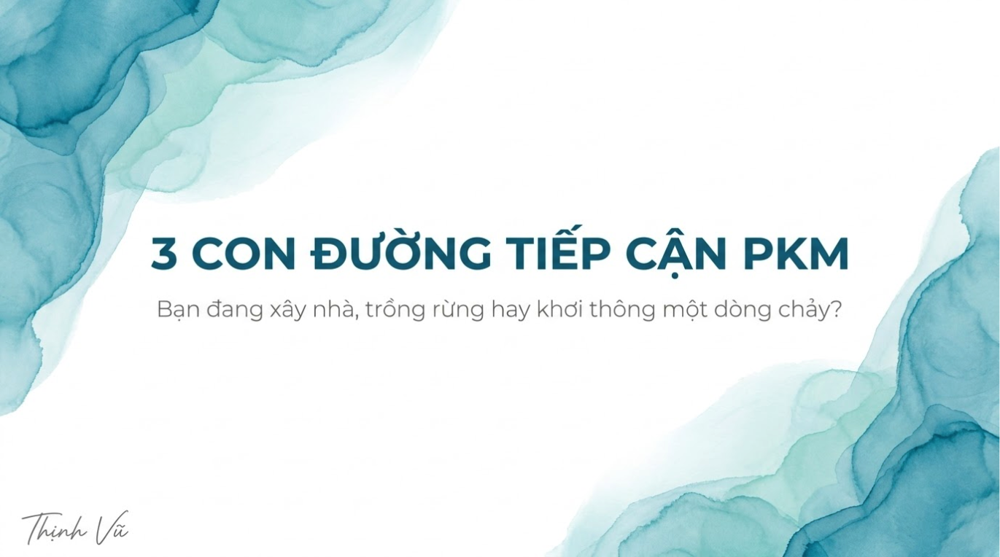

Gần đây, cộng đồng Obsidian xôn xao với khái niệm "LLM Wiki" mà Andrej Karpathy giới thiệu. Rất nhiều người hăm hở lao vào ứng dụng AI trong mọi khâu: tự động tổng hợp, xử lý, trích xuất và dọn dẹp vault. Mục tiêu dường như là duy trì một kho dữ liệu hoàn hảo, không tì vết. 

But giữa sự hào nhoáng đó, dường như chúng ta đang lạc lối. Việc biến Obsidian thành một công cụ "biểu diễn dữ liệu" tự động đã vô tình tước đi giá trị cốt lõi nhất của Quản lý tri thức cá nhân (PKM): **Viết là để tư duy**. Ghi chú không bao giờ chỉ đơn thuần là hành động cóp nhặt thông tin từ bên ngoài (ngoại sinh). Nó phải là quá trình bạn đặt tay lên bàn phím, trăn trở và sinh ra những góc nhìn của riêng mình (nội sinh).

Vậy thực sự, PKM nên được hiểu và vận dụng như thế nào cho đúng bản chất? Xuyên suốt lịch sử phát triển của các phương pháp ghi chú, dù có hàng trăm tên gọi khác nhau, tất cả đều quy tụ về **3 con đường chính đạo** sau đây.

---

### 1. Con đường Top-down: Tư duy của một Kiến trúc sư

Cách tiếp cận **Top-down (Từ trên xuống)** là trường phái phổ biến nhất. Đại diện tiêu biểu cho trường phái này là Tiago Forte với phương pháp PARA nổi tiếng.

- **Bản chất:** Bạn hành động như một Kiến trúc sư. Bạn xây dựng một bộ khung vững chắc (các thư mục lớn, danh mục, cấu trúc) trước, sau đó mới đi tìm nội dung để lấp đầy vào các căn phòng đó.
- **Ưu điểm:** Cực kỳ ngăn nắp, rõ ràng. Bạn luôn biết chính xác mọi thứ nằm ở đâu. Rất phù hợp cho việc Quản lý dự án (Project Management) và đảm bảo các công việc được thực thi (Getting Things Done).
- **Nhược điểm:** Tư duy của chúng ta không hoạt động theo đường thẳng. Khi một ý tưởng thô sơ, lộn xộn vừa nảy ra, việc ép nó vào một cấu trúc cứng nhắc ngay lập tức sẽ tạo ra "ma sát" rất lớn, làm thui chột sự sáng tạo tự nhiên.

### 2. Con đường Bottom-up: Tư duy của một Người làm vườn

Trái ngược hoàn toàn là cách tiếp cận **Bottom-up (Từ dưới lên)**. Đại diện tiêu biểu nhất là Sönke Ahrens với hệ thống Zettelkasten (Hộp ghi chú).

- **Bản chất:** Bạn là một Người làm vườn. Thay vì xây nhà, bạn gieo những hạt giống nhỏ (atomic notes) xuống đất. Bạn để chúng tự do sinh sôi, móc nối với nhau theo thời gian, và chờ đợi những chủ đề lớn tự động hình thành (emergent structures).
- **Ưu điểm:** Khơi nguồn cho những ý tưởng bất chợt (serendipity) và tư duy sáng tạo phi tuyến tính xuất sắc.
- **Nhược điểm:** Nếu thiếu kỷ luật rèn dũa, khu vườn của bạn sẽ nhanh chóng biến thành một bãi cỏ dại mọc lung tung, vô tổ chức. Rất nhiều người dùng Zettelkasten bỏ cuộc vì cuối cùng họ sở hữu 10.000 notes nhưng không thể tìm lại hay xâu chuỗi được gì.

### 3. Con đường Hybrid (FLOW): Dòng chảy tri thức có chủ đích

Thế giới không chỉ có màu trắng và đen. Trong đời sống thực tế, chúng ta luôn chuộng sự lai tạo: bạn chọn xe xăng, xe điện hay xe Hybrid (xăng-điện kết hợp)? Bạn là người hướng nội, hướng ngoại hay Ambivert (hòa trộn cả hai)? 

Sự dung hòa là hoàn toàn tự nhiên—kết hợp ưu điểm của những thái cực đối lập mà không làm chúng triệt tiêu lẫn nhau. Đây chính là triết lý ra đời của con đường thứ ba: **Phương pháp FLOW PKM**.

- **Bản chất:** FLOW là sự kết hợp (Hybrid) tinh tế giữa Top-down và Bottom-up. Ở giai đoạn đầu, FLOW đóng vai trò như một Người làm vườn: cho phép mọi ý tưởng thô sơ được sinh sôi tự nhiên, không gò bó trong không gian của `Capture` và `Forge`.
- **Bước ngoặt:** Khi những ý tưởng này tụ hội đủ số lượng và đạt đến độ "chín muồi" (trưởng thành), FLOW sẽ khoác lên mình chiếc áo của một Kiến trúc sư. Bạn bắt đầu "xây nhà" cho chúng bằng các `Blueprint` (Bản đồ tư duy) và vận dụng cách tiếp cận từ tổng quát đến chi tiết để đào sâu nghiên cứu.

FLOW, đúng như tên gọi, là **"dòng chảy" thuận theo tự nhiên của tri thức**. Nó không cố gắng áp đặt quy tắc từ trên xuống ngay từ đầu, cũng không để mặc dữ liệu phát triển vô kỷ luật. Nó là một dòng chảy được khơi thông có chủ đích.

---

### Tạm kết

Dù bạn đang bị hấp dẫn bởi sự ảo diệu của AI (LLM Wiki), sự ngăn nắp của PARA hay sự tự do của Zettelkasten, hãy nhớ rằng: Công cụ chỉ là lớp vỏ. 

Sứ mệnh của PKM không phải là cuộc chạy đua xem ai có cái Vault đồ sộ nhất hay tự động hóa xịn nhất. Trải nghiệm ưu tiên hàng đầu của Obsidian là không gian tĩnh lặng để bạn thực sự suy nghĩ và viết lách. Hãy chọn cho mình một con đường phù hợp. Và nếu bạn đang mệt mỏi vì sự cứng nhắc của Top-down hay sự hỗn loạn của Bottom-up, có lẽ đã đến lúc bạn cần khơi thông một dòng chảy Hybrid cho chính mình.
