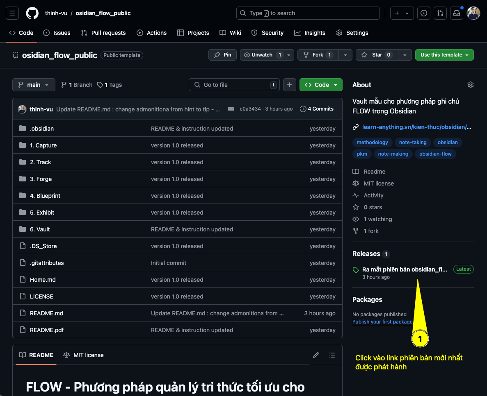
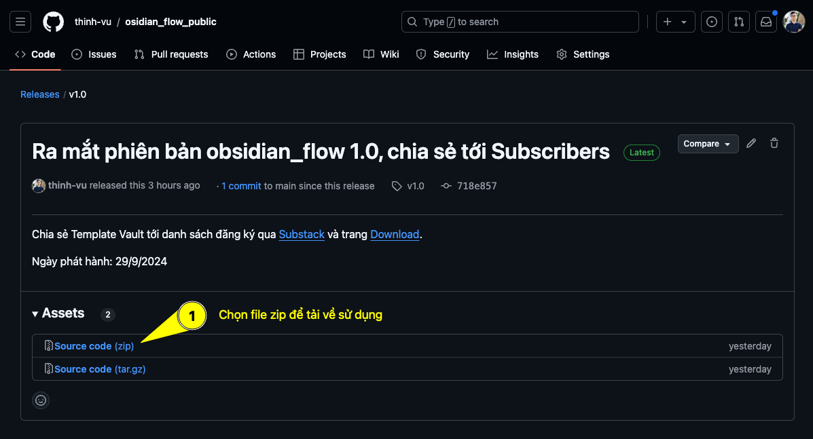
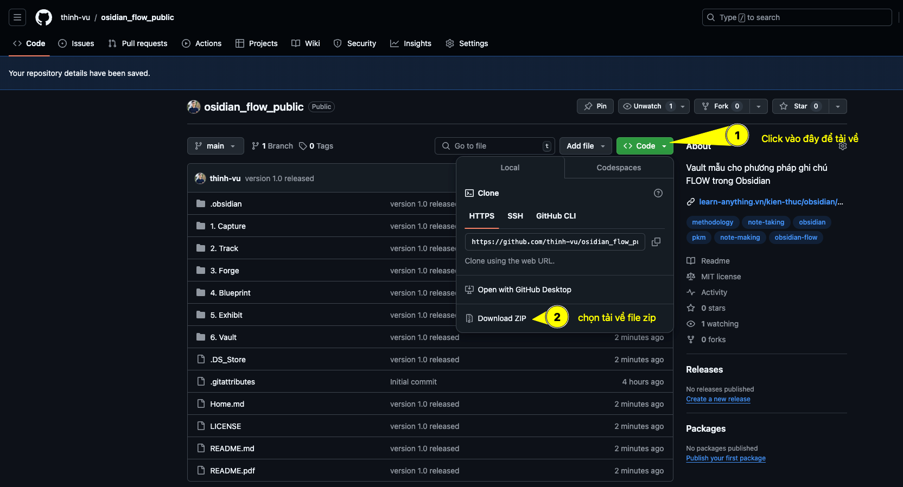
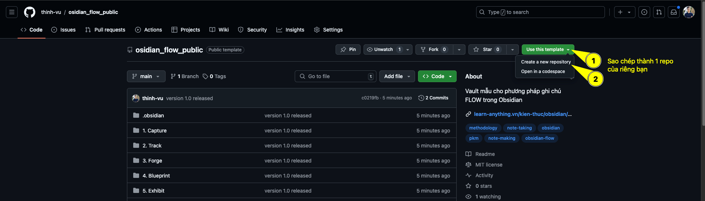

# FLOW - Phương pháp quản lý tri thức tối ưu cho Obsidian

## I. Giới thiệu

> [!tip]
Chào mừng bạn ghé thăm không gian minh hoạ phương pháp quản lý kiến thức FLOW trong Obsidian. 
Phương pháp FLOW do Thịnh Vũ phát triển là kết quả của quá trình trải nghiệm, tương tác và chia sẻ với cộng đồng trong 5 năm qua. 
Obsidian FLOW là kết quả của những trăn trở, tìm tòi và nghiên cứu của anh nhằm tìm ra một hệ thống quản lý linh hoạt, đa dụng và cá nhân hoá quản lý cuộc sống "số" và hành trình tích luỹ kiến thức thú vị hơn.

Phương pháp **FLOW** được tối ưu tối đa cho Obsidian nhưng đồng thời có thể áp dụng với bất kỳ nền tảng dịch vụ lưu trữ và ghi chú nào.

Hy vọng **FLOW** sẽ giúp bạn khám phá một cách tiếp cận đơn giản nhưng mạnh mẽ trong tổ chức thông tin và ý tưởng một cách hiệu quả, linh hoạt và dễ dàng cá nhân hoá theo nhu cầu của bạn.

<iframe width="700" height="480" src="https://www.youtube.com/embed/8hAxzSGylfg?si=cwUjgq5cBDv48qol" title="YouTube video player" frameborder="0" allow="accelerometer; autoplay; clipboard-write; encrypted-media; gyroscope; picture-in-picture; web-share" referrerpolicy="strict-origin-when-cross-origin" allowfullscreen></iframe>

---
## II. Phương pháp FLOW là gì?


Hãy tưởng tượng bạn đang đứng giữa một cánh rừng lớn, đầy những cây xanh và vô số con đường nhỏ không rõ ràng. Đây chính là cảm giác của tôi khi đối mặt với việc quản lý ghi chú. Ý tưởng liên tục tràn ngập, nhưng mọi thứ cứ nằm lộn xộn, không có hệ thống. Mỗi khi cần tìm lại một ghi chú hoặc phát triển một ý tưởng, tôi cảm thấy như đang lạc lối trong chính không gian trí óc của tôi.

Tôi biết tôi cần một con đường rõ ràng hơn – một bản đồ giúp tôi điều hướng qua mớ hỗn độn đó. Và đó là khi phương pháp **FLOW** ra đời. FLOW không chỉ là một phương pháp, nó là lộ trình giúp tôi từ những ý tưởng ban đầu đến khi hoàn thiện, giống như việc rèn một thanh kiếm từ kim loại thô cho đến khi nó trở nên sắc bén và mạnh mẽ. 

**FLOW** là viết tắt của:

- **Forge** (_Rèn Dũa_): Thể hiện quá trình sáng tạo và không ngừng hoàn thiện từ ý tưởng thô sơ cho đến khi hoàn thiện. 
- **Link** (_Liên Kết_): Tượng trưng cho sự kết nối và liên hệ giữa các dự án, ý tưởng và nhiệm vụ khác nhau. **Link** thể hiện việc tổ chức các dự án ở một cấp độ trừu tượng, liên kết chúng với nhau.
- **Organize** (_Tổ Chức_): Đại diện cho việc sắp xếp và trưng bày các thành phẩm hoặc tài liệu đã hoàn thiện. **Organize** mang lại cảm giác trật tự và dễ dàng truy xuất thông tin.
- **Write** (_Viết_): Việc ghi chép và theo dõi tiến trình công việc, phản ánh quá trình phát triển liên tục của ý tưởng. **Write** đại diện cho hành động bắt tay vào việc viết để tư duy rành mạch đồng thời giúp duy trì dòng chảy của công việc.

Nói một cách ngắn gọn, phương pháp FLOW bao gồm một hệ thống các nguyên tắc, hướng dẫn và quy trình giúp bạn có thể làm quen cũng như tích hợp hoàn toàn lối tư duy và phương pháp làm việc vào cuộc sống cá nhân và hành trình tích luỹ tri thức của bạn.

---
## III. Thông tin khoá học Obsidian

Bạn đã có trong tay **Obsidian FLOW** – tấm bản đồ để xây dựng một hệ thống tri thức mạnh mẽ. Nhưng để thực sự làm chủ hành trình và đi xa hơn, Thịnh đã tâm huyết thiết kế 2 lộ trình học giúp bạn đi từ bước làm quen công cụ đến việc kiến tạo một "nhà máy sản xuất tri thức" thực thụ.

### 3.1. Khoá học Obsidian Cơ Bản

[](https://course.learn-anything.vn/courses/khoa-hoc-obsidian-co-ban-cap-do-1)

Việc bắt đầu với một phần mềm tuỳ biến cao như Obsidian có thể khiến bạn cảm thấy "ngợp" và bối rối – đó là cảm giác chung của rất nhiều người. Khoá học **Obsidian Cơ Bản** được sinh ra để biến sự bối rối đó thành sự tự tin trong thời gian ngắn nhất.

Nội dung khoá học được tinh gọn, tập trung dạy bạn **những thứ cực kỳ căn bản về Obsidian dưới góc độ là một công cụ**. Bạn sẽ làm quen nhanh chóng, biết cách thiết lập và sử dụng trọn vẹn các tính năng cốt lõi của ứng dụng ngay khi mới bắt đầu, từ đó tạo bước đệm vững chắc trước khi đào sâu vào Quản lý tri thức (PKM).

### 3.2. Khoá học Obsidian FLOW PKM

[](https://course.learn-anything.vn/courses/khoa-hoc-obsidian-flow-pkm)

Nếu khoá Cơ bản giúp bạn làm chủ công cụ, thì đây là bước tiến đưa tư duy của bạn lên một tầm cao mới: **Quản lý tri thức (PKM)**. 

Khoá học **Obsidian FLOW PKM** đi sâu vào việc làm việc với thông tin và tri thức. Bạn sẽ nắm bắt trọn vẹn phương pháp FLOW để chắt lọc, định hình và liên kết các ý tưởng rời rạc lại với nhau. Đây không đơn thuần là kỹ năng ghi chú, mà là cách bạn biến Obsidian thành một **"nhà máy sản xuất tri thức"** đáng tin cậy, giúp tối ưu hoá sự sáng tạo và xây dựng nguồn tài sản trí tuệ đồng hành cùng bạn suốt đời.

---
### 🎁 ƯU ĐÃI ĐĂNG KÝ KHOÁ HỌC
Nhân dịp ra mắt khoá học mới Obsidian FLOW PKM vào tháng 3/2026, Thịnh dành tặng ưu đãi đặc biệt cho **100 học viên đăng ký đầu tiên**:

**🚀 Khoá học Obsidian FLOW PKM:**
- Giá gốc: 1.499.000đ
- **Giá ưu đãi:** **999.000đ**

[](https://course.learn-anything.vn/courses/khoa-hoc-obsidian-flow-pkm)

> *Đây là một khoản đầu tư nhỏ cho một kỹ năng cốt lõi sẽ thay đổi hoàn toàn cách bạn học tập và làm việc mãi mãi.*

Đừng để sự chần chừ cản bước bạn trên hành trình chinh phục tri thức. Hãy bắt đầu ngay hôm nay!

Chúc bạn thành công và sớm làm chủ được hệ thống Obsidian của riêng mình.

---

## IV. Tải về sử dụng
### 4.1. Tải file zip về giải nén

> [!tip]
> Bạn có thể chọn 1 trong hai cách được hướng dẫn dưới đây để tải về file zip sử dụng.

#### a. Tải theo phiên bản phát hành

**Bước 1: Chọn link bản phát hành mới nhất tại giao diện của repo**



**Bước 2: Chọn file zip Source code để tải về và giải nén ở màn hình tiếp theo**



#### b. Tải từ mục Code > Download ZIP

Sử dụng cách này, bạn tải toàn bộ repo được chia sẻ dưới dạng 1 file zip, giải nén file và mở Open folder as Vault để sử dụng. Mặc định file tải về là mã nguồn cập nhật mới nhất.



### 4.2. Sao chép mẫu Vault dưới dạng 1 repo trong Github của bạn

>[!tip]
> Sử dụng cách này, bạn có thể đồng bộ Github repo về máy và sử dụng Git làm công cụ sao lưu mặc định. Thư mục Git có thể lưu trữ trong OneDrive, Google Drive, vv hay dịch vụ lưu trữ đám mây bất kỳ để tạo lớp sao lưu thứ 2. Khi đồng bộ với Github, bạn có thể xem nhanh các ghi chú thông qua Github mobile mà không cần Obsidian mobile (nhanh hơn), hoặc chỉnh sửa ghi chú với vscode.dev từ Github repo mà không cần đồng bộ trên máy trong những trường hợp bạn không tiện cài đặt Obsidian. Cũng có thể chỉnh sửa ghi chú theo cách này trên smartphone trong 1 số trường hợp cần thiết.



---
## IV. Thiết lập Obsidian Vault của bạn theo phương pháp FLOW

>Bạn có thể tìm thấy nội dung dưới đây tại trang mục lục giới thiệu phương pháp [Obsidian PKM Mastery](4.%20Blueprint/Obsidian%20FLOW%20Methodology.md).
## V. Thiết lập Obsidian Vault của bạn theo phương pháp FLOW
[!tip]
Bạn có thể tìm thấy nội dung dưới đây tại trang mục lục giới thiệu phương pháp [Obsidian PKM Mastery](4.%20Blueprint/Obsidian%20FLOW%20Methodology.md).

```base
filters:
  and:
    - '!file.inFolder("Vault")'
    - 'note.blueprint.contains("Obsidian PKM Mastery")'
    - 'note.impact >= 4'
views:
  - type: table
    properties:
      - tags
    sort:
      - property: note.aliases
        direction: ASC
    sorts:
      - property: note.created
        direction: DESC
```

---
## V. Một số lưu ý khi áp dụng phương pháp FLOW

## VI. Một số lưu ý khi áp dụng phương pháp FLOW
- **Giữ cho hệ thống đơn giản**: Đừng tạo quá nhiều thư mục con phức tạp, hãy giữ cho cấu trúc của bạn dễ hiểu và dễ quản lý.
- **Sử dụng metadata và thẻ một cách thông minh**: Chỉ áp dụng khi cần thiết để hỗ trợ việc tìm kiếm và tổ chức.
- **Thường xuyên xem xét và cập nhật**: Dành thời gian để xem lại và sắp xếp lại ghi chú của bạn, đảm bảo chúng luôn phản ánh đúng trạng thái hiện tại.
- **Cá nhân hóa hệ thống**: Điều chỉnh phương pháp FLOW để phù hợp với nhu cầu và phong cách làm việc của bạn.

---
## VI. Tại sao nên áp dụng phương pháp FLOW?

## VII. Tại sao nên áp dụng phương pháp FLOW?
- **Đơn giản và trực quan**: FLOW giúp bạn tổ chức ghi chú theo một cấu trúc dễ hiểu, giảm thiểu sự phức tạp.
- **Linh hoạt và cá nhân hóa**: Bạn có thể điều chỉnh phương pháp để phù hợp với phong cách làm việc và mục tiêu cá nhân.
- **Hiệu quả trong việc tìm kiếm và truy cập thông tin**: Sử dụng metadata và thẻ một cách có mục đích giúp bạn nhanh chóng tìm thấy những gì tôi cần.

---
## VII. Luôn cập nhật thông tin mới nhất về FLOW


> Bạn có thể đăng ký kênh và theo dõi trang cá nhân của Thịnh để đảm bảo bạn không bỏ lỡ bất kỳ cập nhật mới nhất về FLOW, được kết nối  và chia sẻ những ý tưởng thú vị.
## VIII. Luôn cập nhật thông tin mới nhất về FLOW
[!tip]
Bạn có thể đăng ký kênh và theo dõi trang cá nhân của Thịnh để đảm bảo bạn không bỏ lỡ bất kỳ cập nhật mới nhất về FLOW, được kết nối  và chia sẻ những ý tưởng thú vị.

📰 **Bản tin Substack của Learn Anything:**

- [learnanything.substack.com](https://learnanything.substack.com?utm_source=github&utm_medium=obsidian-flow-public)
- 🏠 **Learn Anything:** [learn-anything.vn](https://learn-anything.vn?utm_source=github&utm_medium=obsidian-flow-public)
- 😄 **Trang cá nhân**: [facebook.com/mr.thinh.ueh](https://www.facebook.com/mr.thinh.ueh)

---
## VIII. Giới thiệu tác giả

## IX. Giới thiệu tác giả


